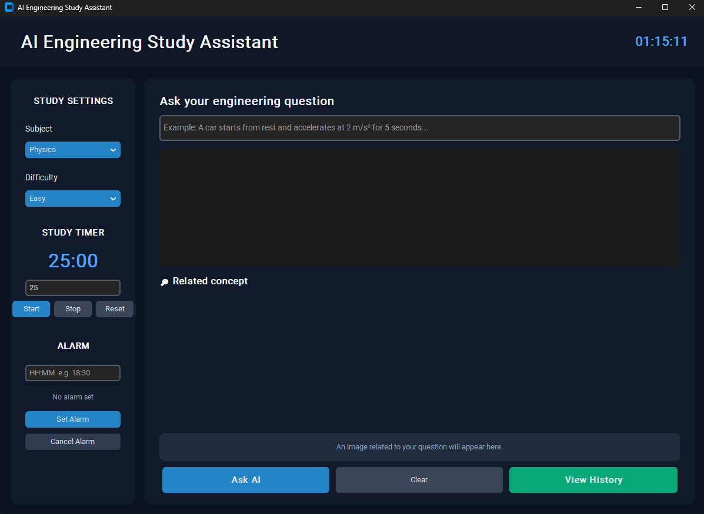

# AI Engineering Study Assistant 🤖📚

An AI-powered desktop study assistant designed to help engineering students understand technical concepts, solve questions, and organize study sessions.

## ✨ Features

- 🤖 AI-powered question answering using Ollama
- 📚 Engineering-focused study assistance
- 🔬 Physics, Mathematics, C Programming, Engineering, and General subjects
- 🎯 Easy, Medium, and Hard difficulty levels
- ⏱️ Built-in study timer
- ⏰ Study alarm
- 🕐 Real-time digital clock
- 🖼️ Related learning resources and images
- 📖 Step-by-step explanations
- 📝 Study question history
- 🎨 Modern dark-themed graphical interface

## 🛠️ Technologies Used

- Python
- CustomTkinter
- Tkinter
- Ollama
- Pillow
- Requests
- BeautifulSoup4

## 📸 Application



## 🚀 Installation

### 1. Install Python

Install Python 3.13 or a compatible Python version.

### 2. Install the required packages

Open Command Prompt and run:

```bash
pip install -r requirements.txt
